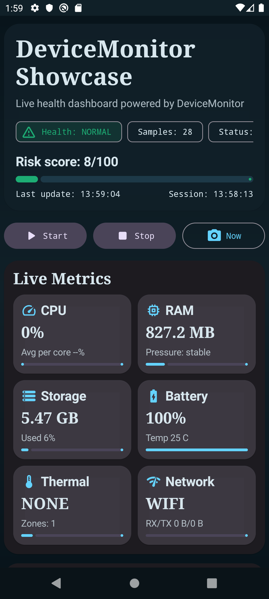
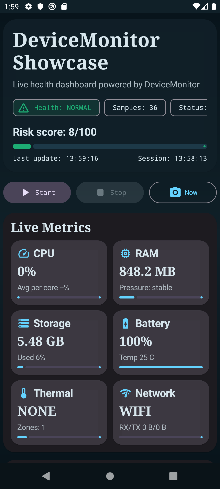

# DeviceMonitor


Lightweight Android device telemetry library.

**DeviceMonitor** helps monitor device health during heavy operations like:

- data export
- archive generation
- media processing
- long background tasks
- CPU intensive workloads

The library continuously collects system metrics and exposes them through **Kotlin Flows**.

---

## Features

DeviceMonitor tracks:

- CPU usage (Some CPU metrics may be limited on newer Android versions due to platform restrictions)
- CPU frequencies
- RAM availability
- Storage free space
- Battery temperature
- Battery level
- Charging state
- Thermal throttling status
- Network type

Data streams:

```
SharedFlow<DeviceSnapshot>  
SharedFlow<DeviceWarningEvent>
```

---

# Installation

## Gradle (Kotlin DSL)

```kotlin
dependencies {
    implementation("io.github.0dimidrol0:DeviceMonitor:0.3.0")
}
```

## Gradle (Groovy)

```groovy
dependencies {
    implementation 'io.github.0dimidrol0:DeviceMonitor:0.3.0'
}
```

---

# Quick Start

init in Application:

```kotlin
DeviceMonitor.init(context)
```

Get monitor instance:

```kotlin
val monitor = DeviceMonitor.getInstance()
```

Start monitoring:

```kotlin
monitor.start()
```

Stop monitoring:

```kotlin
monitor.stop()
```

Take snapshot:

```kotlin
val snapshot = monitor.snapshotNow()
```

Set Storage Low Threshold in MegaBytes:

```kotlin
DeviceMonitor.setStorageLowThreshold(100)
```

Set Memory Low Threshold in MegaBytes:

```kotlin
DeviceMonitor.setMemoryLowThreshold(100)
```

You can also customize sampling cadence, thresholds and sensors via `DeviceMonitorConfig`:

```kotlin
DeviceMonitor.init(
    appContext,
    DeviceMonitorConfig.builder()
        .samplePeriodMs(5_000L)
        .memoryThresholdMb(512)
        .batteryTemperatureThresholdC(48f)
        .enableCpu(true)
        .build()
)
```

---

# Showcase App Module

<p align="center">
  
  
</p>

<p align="center">
  <sub>Main dashboard</sub> &nbsp;&nbsp;&nbsp;&nbsp;&nbsp;&nbsp;&nbsp;&nbsp;
  <sub>Live metrics state</sub>
</p>

This repository now includes a ready-to-use sample app module: `:app`.

It demonstrates:

- live `DeviceSnapshot` rendering
- warning event timeline
- start/stop controls and instant snapshot button
- polished dashboard UI suitable for README screenshots

Run locally:

```bash
./gradlew :app:assembleDebug
```

Install APK from:

```text
app/build/outputs/apk/debug/app-debug.apk
```

---

# Observing Device Metrics

```kotlin
lifecycleScope.launch {
    monitor.snapshots.collect { snapshot ->

        Log.d("DeviceMonitor", "CPU usage: ${snapshot.cpuUsagePercent}")
        Log.d("DeviceMonitor", "Battery temp: ${snapshot.batteryTempC}")
        Log.d("DeviceMonitor", "Free RAM: ${snapshot.memAvailBytes}")
        Log.d("DeviceMonitor", "Storage free: ${snapshot.storageFreeBytes}")

    }
}
```

---

# Extended Telemetry

Additionally, `DeviceSnapshot` provides:

- `thermalZones` — a list of `/sys/class/thermal/thermal_zone*` entries with their type and temperature in °C.
- `networkTraffic` — `TrafficStats` can be used to measure TX/RX and deltas over a period.
- `batteryPower` — `BatteryManager` returns the current in microamps, `chargeCounter`, and battery percentage.
- `frameMetrics` — on Android 7+ you can attach to a window and collect frame duration and jank percentage.

Example of registering FrameMetrics:

```kotlin
override fun onCreate(savedInstanceState: Bundle?) {
    super.onCreate(savedInstanceState)
    DeviceMonitor.init(applicationContext)
    if (Build.VERSION.SDK_INT >= Build.VERSION_CODES.N) {
        DeviceMonitor.getInstance().registerFrameMetrics(window)
    }
}

override fun onDestroy() {
    DeviceMonitor.getInstance().unregisterFrameMetrics()
    super.onDestroy()
}
```

`thermalZones` and `networkTraffic` can be easily serialized to JSON for sending to a server.

---

# Listening for Warning Events

```kotlin
lifecycleScope.launch {
    monitor.warningEvents.collect { event ->

        when (event) {

            is DeviceWarningEvent.ThermalChanged -> {
                Log.w("DeviceMonitor", "Thermal level changed: ${event.to}")
            }

            is DeviceWarningEvent.BatteryLow -> {
                Log.w("DeviceMonitor", "Low battery ${event.levelPercent}% (threshold=${event.thresholdPercent}%)")
            }

            is DeviceWarningEvent.BatteryTemperatureHigh -> {
                Log.w("DeviceMonitor", "Battery overheating ${event.temperatureC}°C")
            }

            is DeviceWarningEvent.CpuOverload -> {
                Log.w("DeviceMonitor", "CPU overloaded ${event.usagePercent}% (cores=${event.coreCount})")
            }

            is DeviceWarningEvent.MemoryLow -> {
                Log.w("DeviceMonitor", "Low memory: ${event.availBytes}")
            }

            is DeviceWarningEvent.StorageLow -> {
                Log.w("DeviceMonitor", "Low storage: ${event.freeBytes}")
            }
        }
    }
}
```

---

# DeviceSnapshot

```kotlin
data class DeviceSnapshot(
    val tsMs: Long,
    val thermalStatus: ThermalLevel,
    val batteryTempC: Float?,
    val batteryLevel: Int?,
    val isCharging: Boolean?,
    val cpuUsagePercent: Float?,
    val cpuUsagePerCore: List<Float>?,
    val cpuFreqKHz: List<Int>?,
    val memAvailBytes: Long?,
    val memThresholdBytes: Long?,
    val memLow: Boolean?,
    val storageFreeBytes: Long?,
    val storageTotalBytes: Long?,
    val networkType: NetworkType?,
    val thermalZones: List<ThermalZoneReading>,
    val frameMetrics: FrameMetricsSnapshot?,
    val networkTraffic: NetworkTrafficSnapshot?,
    val batteryPower: BatteryPowerSnapshot?,
    val uptimeMs: Long?,
    val batteryVoltageMv: Int?,
    val batteryHealth: BatteryHealth?,
    val batteryPlugType: PowerSource?
)
```

---

# Warning Events

```kotlin
    data class ThermalChanged(val from: ThermalLevel, val to: ThermalLevel)
    data class MemoryLow(val availBytes: Long, private val thresholdBytes: Long)
    data class StorageLow(val freeBytes: Long, private val thresholdBytes: Long)
    data class BatteryLow(val levelPercent: Int, val thresholdPercent: Int, val isCharging: Boolean?)
    data class BatteryTemperatureHigh(val temperatureC: Float, val thresholdC: Float)
    data class CpuOverload(val usagePercent: Float, val thresholdPercent: Float, val coreCount: Int)
```

---

# Testing

```bash
./gradlew test
```

Unit tests cover snapshot scoring, configuration builder behavior, and battery health helpers.

---

# Example Use Case

```kotlin
monitor.start()

monitor.snapshotNow()

monitor.stop()
```

Use monitoring to:

- pause work if device overheats
- reduce concurrency when RAM is low
- warn when storage is almost full

---

# Architecture

```
DeviceMonitor
 ├── System Readers
 │   ├── CPU (/proc/stat)
 │   ├── Memory (ActivityManager)
 │   ├── Storage (StatFs)
 │   ├── Battery (BatteryManager)
 │   ├── Thermal (PowerManager)
 │   └── Network (ConnectivityManager)
 │
 ├── Snapshot Builder
 │
 └── SharedFlow
     ├── DeviceSnapshot
     └── DeviceWarningEvent
```

---

# Data Sources

| Source | Purpose |
|------|------|
| ActivityManager | Memory info |
| BatteryManager | Battery level & temperature |
| PowerManager | Thermal status |
| StatFs | Storage statistics |
| /proc/stat | CPU usage |
| /sys/devices/system/cpu | CPU frequencies |

---

# Minimum Requirements

```
minSdk = 26
```

---

# Roadmap

Planned improvements:

- CPU throttling detection
- GPU monitoring
- battery discharge rate
- power consumption estimation
- performance profiling

---

# License

Apache License 2.0

---

# Author

Eric Shvets  
https://github.com/0dimidrol0
